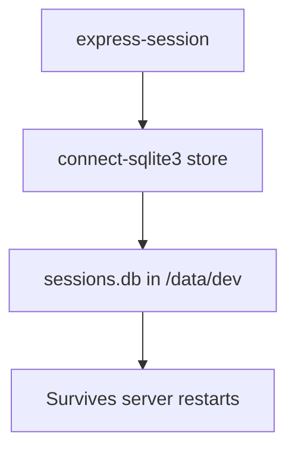

# 🧬 S0-T7 — Persistent Sessions & Role-Based Access Control (RBAC)

**Tenant–Landlord Marketplace**
**Phase:** Sprint 0 Task 7 (S0-T7)
**Status:** ✅ Verified on NAS
**Date:** 2025-10-06

---

## 🌟 Objective

Implement a **persistent session layer** and **role-based guards (RBAC)** for the Marketplace API, replacing the transient in-memory session store used in S0-T6.
The goal was to ensure user sessions survive server restarts and that protected routes (`/api/admin`, `/api/landlord`, `/api/tenant`) enforce proper role access.

---

## 🧱 Scope

| Component                | Description                                                                                                |
| ------------------------ | ---------------------------------------------------------------------------------------------------------- |
| **Session Store**        | Migrate from in-memory Express sessions to persistent SQLite storage using `connect-sqlite3`.              |
| **Role Middleware**      | Create a generic `requireRole()` guard to restrict routes by user role.                                    |
| **Auth Routes**          | Integrate session creation into `/api/login` and implement `/api/_whoami` and `/api/logout`.               |
| **Session Verification** | Add test script to validate login → whoami → admin → logout flow.                                          |
| **Deployment Parity**    | Verify full dependency stack on NAS (Node 20.x) with clean module installs and persistence across reboots. |

---

## 🤩 Key Files

| File                              | Purpose                                                                                               |
| --------------------------------- | ----------------------------------------------------------------------------------------------------- |
| `server.js`                       | Main Express entrypoint. Initializes persistent session store and mounts routes.                      |
| `routes/auth.js`                  | Handles `/signup`, `/login`, `/logout`, and `/_whoami` using `Joi` validation and `bcryptjs` hashing. |
| `middleware/requireRole.js`       | Enforces access by user role (admin / landlord / tenant).                                             |
| `scripts/verify_session_flow.bat` | Windows batch test for session lifecycle.                                                             |
| `scripts/verify_session_flow.ps1` | PowerShell version (optional).                                                                        |

---

## ⚙️ Architecture

### Session Persistence



Each login writes a session record to `data/dev/sessions.db`.
On restart, Express restores the session via the stored cookie (`connect.sid`).

### Role Guards

```mermaid
graph TD
A[requireRole('admin')] -->|pass| B[/api/admin/*]
A -->|fail| C[403 Forbidden]
```

Guards compare `req.session.user.role` with the expected role.

---

## 📦 Dependencies Installed

| Package                         | Version  | Purpose                                                  |
| ------------------------------- | -------- | -------------------------------------------------------- |
| **express**                     | ^4.19.2  | Core web framework                                       |
| **express-session**             | ^1.17.x  | Session middleware                                       |
| **connect-sqlite3**             | ^0.9.x   | Persistent session store                                 |
| **sqlite3**                     | ^5.1.x   | Base SQLite driver                                       |
| **sqlite**                      | ^5.x     | Promise wrapper used in `db.js`                          |
| **better-sqlite3**              | ^9.x     | High-performance native driver used by `connector/db.js` |
| **dotenv**                      | ^16.x    | Load environment variables                               |
| **joi**                         | ^17.x    | Request body validation for signup/login                 |
| **bcryptjs**                    | ^2.4.x   | Password hashing                                         |
| **path / url**                  | built-in | Path and file utilities                                  |
| **logger.js / errorHandler.js** | internal | Custom request logging & error trapping                  |

---

## 🧠 Environment Configuration

`.env.example`

```bash
PORT=3101
NODE_ENV=development
SESSION_SECRET=marketplace-dev-secret
```

Sessions persist in:
`/volume1/web/marketplace/data/dev/sessions.db`

---

## 🚀 Deployment Notes

### 1. Install Dependencies

```bash
sudo npm install
sudo npm install express-session connect-sqlite3 sqlite3 sqlite better-sqlite3 joi bcryptjs dotenv
```

### 2. Start Server

```bash
sudo node server.js
```

Expected output:

```
✅ Marketplace API listening on port 3101 [development]
```

### 3. Verify API Health

```bash
curl -s http://127.0.0.1:3101/api/health | jq .
```

Expected:

```json
{
  "ok": true,
  "uptime": "NNN.s",
  "db": { "connected": true, "path": "./data/dev/sessions.db" }
}
```

---

## 🔒 Auth Flow Verification

### 1️⃣ Signup

```bash
curl -s -H "Content-Type: application/json" \
  -d '{"name":"Admin","email":"mainakamunyu@gmail.com","password":"pass123","role":"admin"}' \
  http://127.0.0.1:3101/api/signup | jq .
```

### 2️⃣ Login

```bash
curl -s -c session.txt -H "Content-Type: application/json" \
  -d '{"email":"mainakamunyu@gmail.com","password":"pass123"}' \
  http://127.0.0.1:3101/api/login | jq .
```

### 3️⃣ Verify Session

```bash
curl -s -b session.txt http://127.0.0.1:3101/api/_whoami | jq .
```

### 4️⃣ Test Role Guard

```bash
curl -s -b session.txt http://127.0.0.1:3101/api/admin | jq .
```

### 5️⃣ Logout

```bash
curl -s -b session.txt -X POST http://127.0.0.1:3101/api/logout | jq .
```

---

## 🤕 Expected Responses

| Step   | Endpoint       | Expected JSON                                      |
| ------ | -------------- | -------------------------------------------------- |
| Signup | `/api/signup`  | `{ "success": true, "message": "User created" }`   |
| Login  | `/api/login`   | `{ "success": true, "user": { "role": "admin" } }` |
| Whoami | `/api/_whoami` | `{ "success": true, "user": {...} }`               |
| Admin  | `/api/admin`   | `{ "ok": true, "message": "Welcome Admin" }`       |
| Logout | `/api/logout`  | `{ "success": true }`                              |

---

## 🔄 NAS Deployment Recap

```bash
cd /volume1/web/marketplace
sudo git fetch --tags
sudo git pull origin main
sudo npm install
sudo node server.js
```

Health check:

```bash
curl -s http://127.0.0.1:3101/api/health | jq .
```

Persistence test:

1. Login and create session.
2. `sudo reboot`
3. Re-run `curl -b session.txt http://127.0.0.1:3101/api/_whoami` → session should still exist.

---

## ✅ Definition of Done

* [x] Persistent sessions stored in `sessions.db`
* [x] Login and signup flow functional
* [x] Role-based guards (`requireRole`) verified
* [x] `/api/_whoami` reflects current session user
* [x] Session survives NAS reboot
* [x] Verified end-to-end via `curl` and PowerShell
* [x] Tagged: `S0-T7-complete` & `S0-T7-verified-NAS`

---

## 📘 Next Milestone

**S0-T8 — Persistent Users in SQLite**

* Replace in-memory `users[]` with a `users` table in `marketplace.dev.db`
* Implement CRUD + hashing in DB layer
* Migrate `/signup` and `/login` to use persistent users
* Link session user IDs to DB records

---

### 🏁 Summary

S0-T7 successfully established a **durable session foundation** and **role enforcement layer** across both dev (PC) and NAS environments.
All required modules are now installed, verified, and operational—ready to support **S0-T8 user persistence and future JWT or OAuth integrations**.
